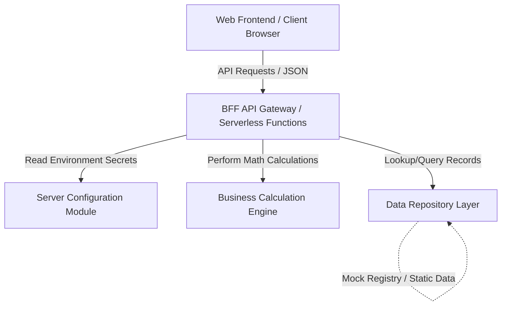

# High-Level Architecture Design: Renovuj Backend

This document describes the high-level architecture of the Renovuj backend. It is designed to be fully modular, self-contained, and easily migratable to any target application framework.

## System Architecture Blueprint

Renovuj utilizes a **Backend-for-Frontend (BFF)** architectural pattern. The frontend client does not run direct database operations or perform sensitive computations; instead, it communicates with the BFF layer via structured API endpoints.

## Key Architectural Components

### 1. BFF API Gateway (`src/backend/index.ts`)
*   **Role**: Entry point for client requests. Integrates input validation using schema-based libraries (Zod).
*   **Security**: Validates all incoming payloads, filters query parameters, and shields the database/calculators from unvalidated data.

### 2. Business Calculation Engine (`src/backend/calculator.ts`)
*   **Role**: Contains pure mathematical functions for building metrics.
*   **Key Modules**:
    *   **Financials**: Computes loan interest options, energy saving rates, flat-level splits, and property valuation uplifts.
    *   **Urgency Curve**: Integrates the compound utility waste curve and materials/labor inflation curves over time.

### 3. Data Repository Layer (`src/backend/db.ts`)
*   **Role**: Serves as the database abstraction. Currently houses in-memory static records and mock registries.
*   **Mock Collections**:
    *   `INFERRED_PROPERTIES`: Simulated cadastral records mapped by address.
    *   `NEIGHBOURS`: Geolocated properties in Prague with manager contact metadata.
    *   `PERSONAS`: Resident psychology templates representing typical SVJ building owners.
    *   `QUESTIONS`: Rules configuring the dynamic conditional wizard flow.

### 4. Server Configuration (`src/backend/config.ts`)
*   **Role**: Handles environment configuration.
*   **Security**: Prevents leakage of sensitive keys (API tokens, database credentials) to the client. Uses a multi-tiered fallback strategy and warning logs for ephemeral execution.

---

## Data Flow & Processing Lifecycle

### 1. Property Onboarding & Inference Flow
When a user enters an address, the system queries the property details:
1. Client sends a `POST /api/property` request containing the address string.
2. The BFF validates the address string, sanitizes it, and queries the database.
3. The Database matches the address (mocked to a Vinohrady činžovní dům) and returns architectural details (flats, year built, layout, heating systems).

### 2. Renovation Financial & Urgency Projection Flow
Once goals are selected, financial and urgency calculations are computed:
1. Client calls `POST /api/calculate` with property specifications, selected goals, and answers.
2. The Calculation Engine runs:
    *   `calculateFinancials`: Computes blended financing splits (NZÚ interest-free loans vs. commercial top-ups) and flat-level net monthly impact (savings vs. repayments).
    *   `buildUrgencyData`: Computes the integral of wasted utilities and compounded construction inflation over an 8-year horizon.
3. Response is serialized to JSON and sent to the client for rendering charts.

---

## Security Safeguards

### 1. Input Sanitization & Type Safety
All endpoints enforce rigid Zod schemas. Untrusted inputs are filtered out before reaching execution paths.

### 2. BFF Key Protection
All secret keys and credentials are read strictly on the server-side (`.server.ts` or `config.ts`). No secrets are bundled into client-side code.

### 3. File Upload Integrity (Energy Label PDFs)
If the project is expanded to parse energy label PDFs:
*   Files are capped at 10 MB.
*   MIME type and file signature (magic bytes) must be verified to be `application/pdf`.
*   Uploaded files are renamed to UUIDs and stored outside the web root in a non-executable directory to prevent script injection.
